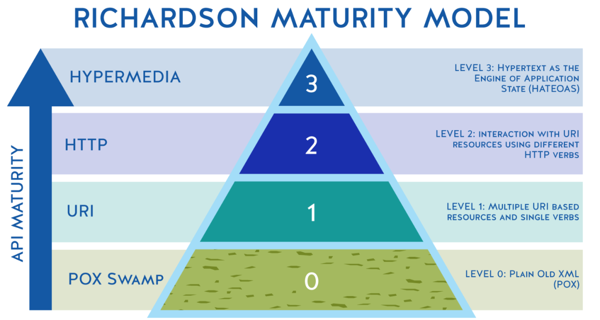

# Lógica de negocio
## Qué es la lógica de negocio
La lógica de negocio es la capa que se encuentra entre la interfaz de usuario, encargada de presentar los datos al usuario, y la capa de acceso a datos que es responsable de almacenar y recuperar los datos de una base de datos.

La lógica de negocio es la parte más importante en nuestra aplicación, es la que maneja, valida y procesa la información recibida y determina qué y cómo se va a almacenar. Implementa los casos de uso del documento de requisitos de la aplicación.

La lógica de negocio determina como manejar la información que contienen nuestros objetos, que procesos debe ejecutar, reglas que debe cumplir, etc.

### Ejemplo
Procesar un pedido

```
public class OrderProcessor {
   public static void processOrder(Order order) {
      // Validate order
      if (!order.isValid()) {
         throw new InvalidOrderException("Invalid order");
      }
    
      // Apply business rules
      if (order.getTotal() > 1000) {
         order.setDiscount(0.1);
      }
    
      // Prepare data for storage
      order.setStatus(OrderStatus.PROCESSED);
    
      // Save order to database
      OrderDAO.save(order);
   }
}

````
`Fuente: [www.tutorialspoint.com/what-is-the-business-logic-layer](https://www.tutorialspoint.com/what-is-the-business-logic-layer)`



*** 
###### Enlaces de interés
- [www.tutorialspoint.com/what-is-the-business-logic-layer](https://www.tutorialspoint.com/what-is-the-business-logic-layer)
- [www.geeksforgeeks.org/business-logic-layer](https://www.geeksforgeeks.org/business-logic-layer/)